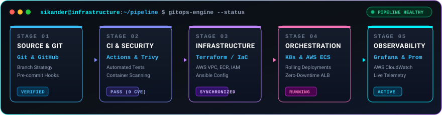

<div align="center">

  <!-- Futuristic Cyberpunk / Terminal Banner -->
  

  <!-- Animated Typing SVG with Neon / Terminal Accent -->
  <a href="https://sikanderkumbhar.com">
    
  </a>

  <!-- Primary Roles & Connect Badges -->
  <p align="center">
    <a href="https://signdevops.com/" target="_blank">
      
    </a>
    <a href="https://technofreaks.online/" target="_blank">
      
    </a>
    <a href="https://sikanderkumbhar.com" target="_blank">
      
    </a>
  </p>

  <!-- Social & Telemetry Badges -->
  <p align="center">
    <a href="https://linkedin.com/in/sikanderkumbhar" target="_blank">
      
    </a>
    <a href="mailto:sikanderalikumbhar1@gmail.com">
      
    </a>
    <a href="https://github.com/SIKANDERKUMBHAR">
      
    </a>
  </p>

  <p align="center">
    
  </p>

</div>

---

### ⚡ System Diagnostics & Identity Matrix

```yaml
# Sikander's Runtime Configuration
identity:
  name: "Sikander Ali"
  roles:
    - title: "DevOps Engineer"
      organization: "SignDevops"
      url: "https://signdevops.com/"
    - title: "Founder"
      organization: "TechnoFreaks"
      url: "https://technofreaks.online/"
  origin: "Karachi, Sindh, Pakistan 🇵🇰"
  status: "🚀 Architecting cloud systems & empowering tech communities"

mission:
  philosophy: "Infrastructure as Code, Automated Everything, Zero Downtime"
  focus_areas: ["Kubernetes", "Ansible", "Cloud Security", "GitOps", "Terraform", "AWS Architecture"]

telemetry:
  uptime: "Continuous"
  target_environments: ["AWS Cloud", "Hybrid VMware", "Bare Metal Linux"]
  active_terminal: "sikanderalikumbhar1@gmail.com"
```

---

### 💼 Current Roles & Leadership

<div align="center">

| Role | Organization | Focus & Specialization | Web Endpoint |
| :--- | :--- | :--- | :---: |
| 🛡️ **DevOps Engineer** | **SignDevops** | Cloud Architecture, Container Orchestration, CI/CD Automation & SRE | [](https://signdevops.com/) |
| 🚀 **Founder** | **TechnoFreaks** | Tech Community Leadership, Developer Mentorship & Cloud Innovation | [](https://technofreaks.online/) |

</div>

---

### 🚀 Continuous Delivery & Infrastructure Pipeline

<div align="center">
  
</div>

```console
┌──(sikander㉿devops-node)-[~/production-pipeline]
├── ⚙️ [STAGE 01] Git Webhook Triggered ────➔ Commit verified & signed [main branch]
├── 🧪 [STAGE 02] Automated Test Suites ────➔ Unit & integration tests passed (0 regressions)
├── 🛡️ [STAGE 03] Trivy Security & SBOM ────➔ 0 Critical | 0 High CVEs detected
├── 🐳 [STAGE 04] Docker Container Build ───➔ Multi-stage hardened image pushed to AWS ECR
├── 🏗️ [STAGE 05] Terraform Infrastructure ──➔ Declarative IaC plan executed & state synced
├── 🚀 [STAGE 06] Kubernetes Deployment ────➔ Rolling update completed (zero-downtime, 100% healthy)
└── 📊 [STAGE 07] Telemetry & Monitoring ───➔ Prometheus metrics scraping & Grafana alerts active
```

---

### 🛠️ Technology Arsenal & Cloud Ecosystem

<div align="center">

#### ☁️ Cloud & Virtualization
<p align="center">
  
  
  
  
</p>

#### ⚙️ Infrastructure as Code & Orchestration
<p align="center">
  
  
  
  
  
</p>

#### 🔄 CI/CD Automation & GitOps
<p align="center">
  
  
  
  
</p>

#### 📊 Observability, Networking & Monitoring
<p align="center">
  
  
  
  
</p>

#### 💻 Programming & Backend Services
<p align="center">
  
  
  
  
  
</p>

#### 🗄️ Database & Storage Engines
<p align="center">
  
  
  
  
</p>

</div>

---

### 📊 Real-Time Telemetry & Contribution Metrics

<div align="center">

  <p align="center">
    
    &nbsp;
    
  </p>

  <p align="center">
    
  </p>

</div>

---

### 🎮 Contribution Matrix (Interactive Snake)

<div align="center">
  
</div>

---

### 💼 Featured Architecture & DevOps Repositories

| Repository | Tech Stack | Description | Status |
| :--- | :--- | :--- | :---: |
| 🛡️ **Terraform-AWS-Production-Ready** | `Terraform`, `AWS VPC`, `ECS`, `ALB` | Modular IaC templates for zero-downtime microservice deployments | `Active` |
| 🚢 **K8s-GitOps-Cluster-Deployment** | `Kubernetes`, `Helm`, `ArgoCD` | Scalable cluster manifests with automated rollback & health checks | `Active` |
| ⚡ **GitHub-Actions-CI-CD-Templates** | `GitHub Actions`, `Docker`, `Trivy` | Multi-stage build, container scanning, and automated AWS ECR push | `Active` |

---

<div align="center">
  
  <p><b>Designed & Engineered for High-Availability by Sikander Ali 🚀</b></p>
</div>
